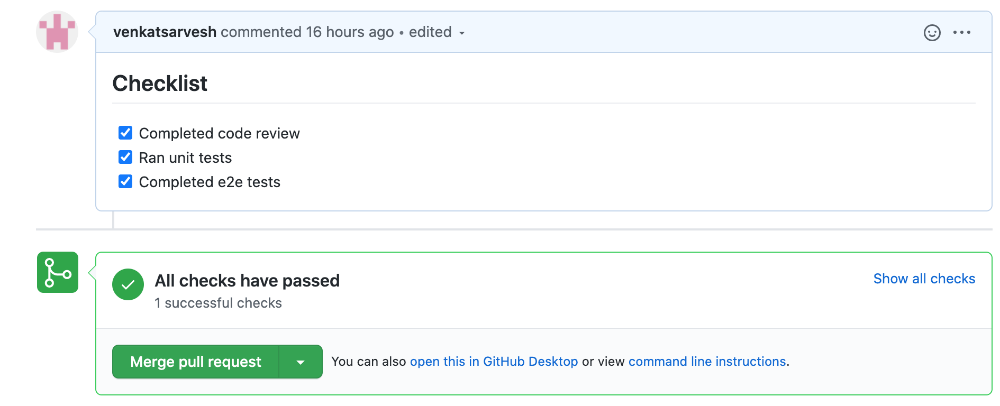
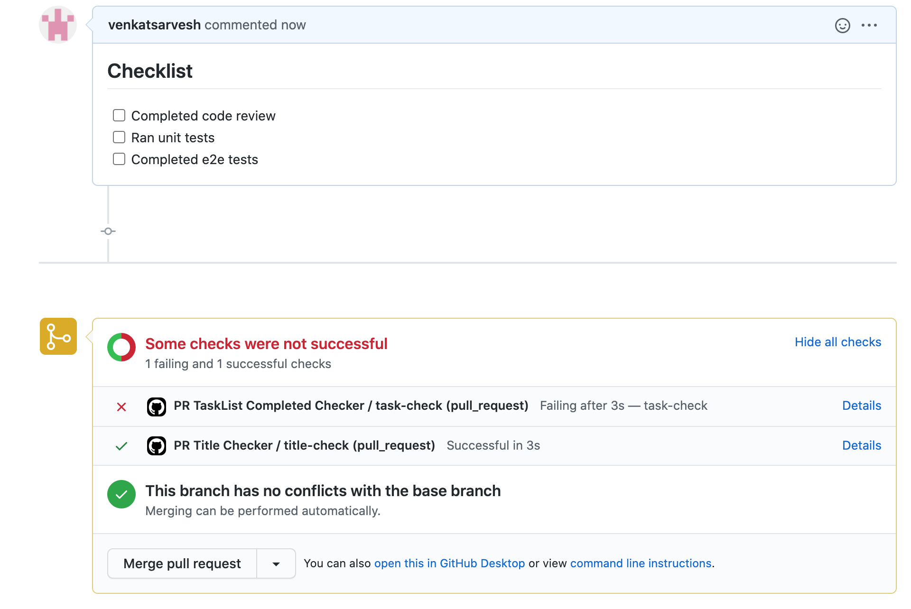

# PR TaskList Required Items Validator

A GitHub action that validates required tasks in pull request descriptions, with support for optional items and sections.

## Features

- ✅ Validates required checklist items in PR descriptions
- 🔄 Supports individual optional tasks with `(optional)` suffix
- 📑 Enables optional sections using HTML comments
- ❌ Fails PR check if required tasks are incomplete
- 📝 Provides detailed list of pending required tasks

## Installation

Add the action to your repository's workflow:

```yaml
- uses: iukekini/pr-tasks-validator-action@v1
  with:
    repo-token: "${{ secrets.GITHUB_TOKEN }}"
```

## Usage

### Workflow Configuration

Create `.github/workflows/pr-tasks.yml`:

```yaml
name: "Check Required PR Tasks"
on:
  pull_request:
    types: [edited, opened, synchronize, reopened]

jobs:
  task-check:
    runs-on: ubuntu-latest
    steps:
      - uses: iukekini/pr-tasks-validator-action@v1.0.1
        with:
          repo-token: "${{ secrets.GITHUB_TOKEN }}"
```

### Task List Syntax

Add tasks to your PR description using any of these formats:

```markdown
## Required Tasks

- [ ] Code review completed
- [ ] Unit tests passing
- [ ] This task is optional (optional)

## Nice to Have

<!-- begin of optional -->

- [ ] Performance tests
- [ ] Documentation updates
<!-- end of optional -->

- [ ] Non required Tasks (optional)

## More Tasks

- [ ] Integration tests passing
```

The action will:

- Fail if required tasks are unchecked
- Skip tasks marked with `(optional)`
- Ignore all tasks between optional HTML comments

## Examples

### Success Case

When all required tasks are complete:


### Failure Case

When required tasks are pending:


### Task List Output

View pending tasks in the Actions tab:
![List of pending tasks](
